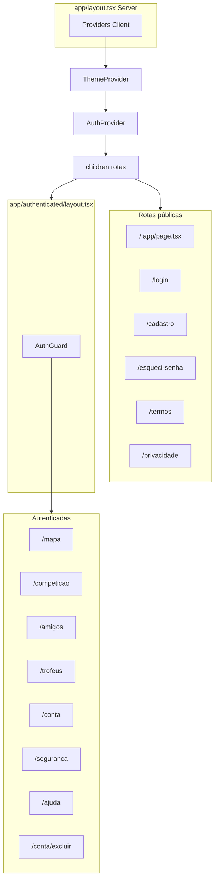

# DOC_RenderTree

## Árvore conceitual (rotas principais)

## Padrão de páginas autenticadas

Muitas páginas em `(authenticated)/` usam [`AuthenticatedShell`](../../components/layout/authenticated-shell.tsx) + [`Header`](../../components/layout/header.tsx) + eventualmente [`MobileBottomNav`](../../components/layout/mobile-bottom-nav.tsx).

**Exceção:** `/mapa` tende a layout full-screen (sem shell típico); ver [DOC_TelaMapa.md](../Telas/DOC_TelaMapa.md).

## Fluxo de dados para o mapa

1. `AuthProvider` sincroniza utilizador Firebase → `auth-store` + `currentUserId` na `territory-store`.
2. [`useFirestoreTerritorySync`](../../hooks/use-firestore-territory-sync.ts) subscreve territórios via repositório → atualiza `territory-store`.
3. [`TerritoryMap`](../../components/map/territory-map.tsx) + [`MapControlsOverlay`](../../components/map/map-controls.tsx) leem stores e Firebase conforme necessário.

## Server vs Client

- **Server Components:** layouts sem `'use client'`, páginas que apenas compõem sem estado.
- **Client Components:** tudo o que usa hooks, Leaflet, Zustand direto, Firebase cliente — marcado com `'use client'`.
