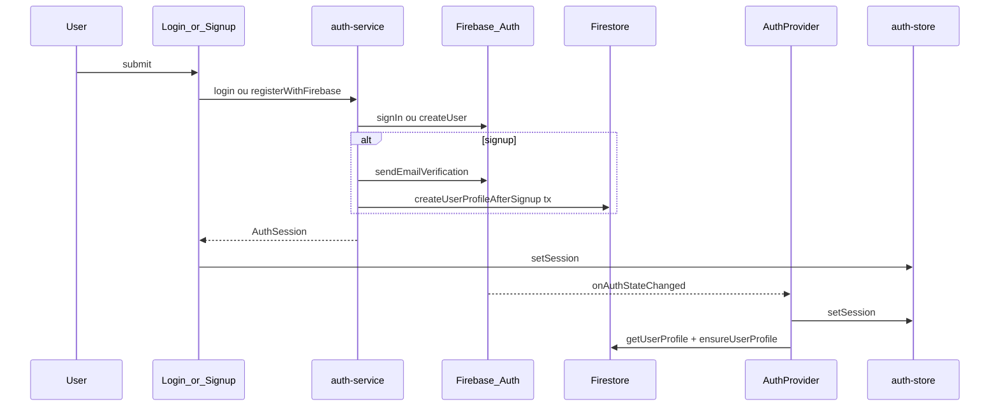

# Arquitectura de Autenticação — TerritoryRun

## Stack

| Camada | Tecnologia |
|--------|------------|
| Identidade | Firebase Authentication (email/senha, Google) |
| Perfil | Cloud Firestore (`users`, `publicProfiles`, `usersPrivate`, `usernames`) |
| Sessão cliente | Firebase Auth SDK + Zustand (`territoryrun-auth` em localStorage) |
| APIs protegidas | Next.js Route Handlers + `verifyAuthOrFail` (Admin SDK) |

## Ciclo de vida da sessão

## Cadastro (email/senha)

1. Validação Zod (`signupSchema`) — senha **literal**, sem espaços nas pontas.
2. `createUserWithEmailAndPassword(email, password)` — password sem trim.
3. `sendEmailVerification` (best-effort, não bloqueia).
4. `updateProfile(displayName)`.
5. Transação Firestore: `usernames/{slug}` → `users` → `publicProfiles` → `usersPrivate`.
6. Rollback: se Firestore falhar → `deleteUser` no Auth.

## Login

1. Validação Zod (`loginSchema`) — e-mail normalizado, senha literal.
2. `signInWithEmailAndPassword` — uma única tentativa, sem fallback de trim.
3. `firebaseUserToSession` → `setSession` + redirect `/mapa`.

## Persistência

- **Firebase Auth:** `browserLocalPersistence` (fallback `inMemoryPersistence`).
- **Zustand:** persiste `user` + `expiresAt`; **não** persiste `accessToken`.
- **Autenticado na UI:** `selectIsAuthenticated` → `Boolean(user)`.
- **APIs:** `getFreshIdToken(true)` via `auth.currentUser`.

## Utilizador fantasma

Se `users/{uid}` não existir mas Firebase Auth tiver sessão:
- `AuthProvider` regista `auth_phantom_user_detected` (CRITICAL).
- Chama `ensureUserProfile` para criar perfil mínimo.

## Rotas API auth

| Rota | Uso |
|------|-----|
| `POST /api/auth/resolve-identifier` | Pré-login username→email (rate-limit 10/min/IP). **Não usada pelo login actual** (login só com e-mail). |

`POST /api/auth/create-profile` foi **removida** — perfil criado no cliente via `createUserProfileAfterSignup`.

## Migração de utilizadores com senha antiga (trim bug)

Utilizadores que cadastraram com espaços nas pontas e trim inconsistente:
1. Usar **Esqueci minha senha** (`/esqueci-senha`).
2. Definir nova senha (schema bloqueia espaços nas pontas).
3. Login com e-mail + nova senha.
