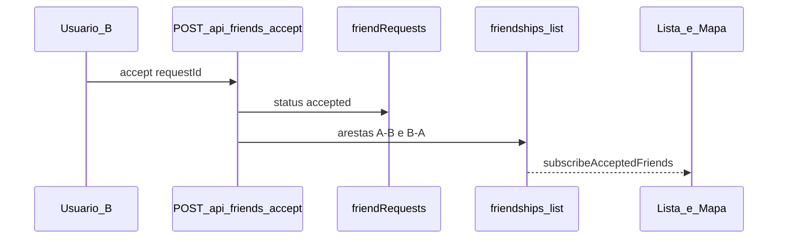

# BUG — Amizade aceita mas amigo não aparece na lista / mapa

**Data:** 2026-05-29  
**Status:** Corrigido (código) — homologação manual pendente  
**Escopo:** fluxo de amizade apenas (sem territorial, XP, dashboard, ranking, auth, loja, notificações)

---

## 1. Diagnóstico completo

### Sintoma reportado

1. Convite enviado e recebido corretamente.
2. Aceite aparenta sucesso (toast + pedido some da lista de pendentes).
3. Amigo **não** aparece em **Amigos**.
4. Territórios do amigo **não** aparecem no mapa.

### Causa raiz

Arquitetura em **duas coleções** com ponte quebrada:

| Coleção | Escrita no aceite (antes) | Leitura na UI |
|---------|---------------------------|---------------|
| `friendRequests/{id}` | Cliente: `status: 'accepted'` | Só pedidos `pending` |
| `friendships/{uid}/list/{friendUid}` | **Ninguém** (CF não deployada) | Lista, mapa, rules, APIs |

O cliente atualizava apenas `friendRequests`. A lista e o mapa leem **exclusivamente** o grafo `friendships`. Esse grafo só era populado pela Cloud Function `onFriendRequestStatusChange` ([`functions/src/index.ts`](../functions/src/index.ts)). Se a CF não estiver deployada ou falhar, `friendRequests` fica `accepted` mas `friendships/.../list/...` **não existe**.

### Confirmação da causa (validação estática + checklist Firebase)

| Verificação | Resultado esperado com bug | Como confirmar |
|-------------|---------------------------|----------------|
| `friendRequests/{id}.status` | `accepted` | Firebase Console |
| `friendships/{A}/list/{B}` | **ausente** | Firebase Console |
| `friendships/{B}/list/{A}` | **ausente** | Firebase Console |
| `subscribeAcceptedFriends` | retorna `[]` | Listener em `friendships` |

**Conclusão:** causa raiz = **grafo `friendships` não criado após aceite**.

---

## 2. Fluxo real vs esperado

### Esperado



### Real (com bug)

Cliente fazia `updateDoc` em `friendRequests` → toast imediato → CF ausente → grafo vazio → UI vazia.

### Divergência frontend vs backend

**Não há divergência de fonte entre módulos.** Todos leem `friendships/{uid}/list`:

- [`hooks/use-friend-ids.ts`](../hooks/use-friend-ids.ts)
- [`hooks/use-firestore-territory-sync.ts`](../hooks/use-firestore-territory-sync.ts)
- [`firestore.rules`](../firestore.rules) — `isFriendOf()`
- [`lib/firebase/admin-friendship.ts`](../lib/firebase/admin-friendship.ts)

O problema era **escrita** do grafo, não leitura inconsistente.

---

## 3. Correção mínima aplicada

### Opção implementada: API server-side (Opção B do plano)

Aceite atômico via Admin SDK — funciona **com ou sem** Cloud Function deployada (idempotente).

| Arquivo | Alteração |
|---------|-----------|
| [`lib/firebase/admin-friendship-sync.ts`](../lib/firebase/admin-friendship-sync.ts) | **Novo** — `createFriendshipEdges`, `acceptFriendRequestWithGraph` |
| [`app/api/friends/accept/route.ts`](../app/api/friends/accept/route.ts) | **Novo** — `POST` autenticado |
| [`lib/firebase/friends.ts`](../lib/firebase/friends.ts) | `acceptFriendRequest` chama API em vez de `updateDoc` direto |
| [`app/(authenticated)/amigos/page.tsx`](../app/(authenticated)/amigos/page.tsx) | `.catch()` + `toast.error` em falha |

### Comportamento após correção

1. B clica Aceitar → `POST /api/friends/accept` com Bearer token.
2. Servidor valida: destinatário = caller, status = `pending`.
3. Transação Admin: `friendRequests` → `accepted` + arestas bidirecionais em `friendships`.
4. `subscribeAcceptedFriends` recebe snapshot → amigo na lista.
5. `useFirestoreTerritorySync` inclui friend UID → territórios no mapa.

**Idempotência:** se pedido já `accepted`, API recria arestas em falta e retorna `alreadyAccepted: true` (teste 7).

---

## 4. Arquivos, funções e coleções envolvidos

### Arquivos

- `lib/firebase/admin-friendship-sync.ts` — sync grafo (Admin)
- `app/api/friends/accept/route.ts` — endpoint aceite
- `lib/firebase/friends.ts` — cliente chama API
- `app/(authenticated)/amigos/page.tsx` — UX erro
- `functions/src/index.ts` — CF rede de segurança (opcional, não alterada)
- `scripts/backfill-friendships.ts` — amizades históricas

### Funções

| Função | Papel |
|--------|-------|
| `acceptFriendRequest` (client) | Chama API |
| `acceptFriendRequestWithGraph` (server) | Transação request + grafo |
| `createFriendshipEdges` (server) | Arestas bidirecionais idempotentes |
| `subscribeAcceptedFriends` | Listener lista/mapa |
| `onFriendRequestStatusChange` (CF) | Backup se deployada |

### Coleções Firestore

- `friendRequests/{id}` — convites (`pending` → `accepted`)
- `friendships/{ownerUid}/list/{friendUid}` — grafo canónico

### Rules relevantes

```108:124:firestore.rules
    function isFriendOf(ownerUserId) {
      return isSignedIn()
        && exists(/databases/$(database)/documents/friendships/$(request.auth.uid)/list/$(ownerUserId));
    }
    // ...
    match /friendships/{ownerUid}/list/{friendUid} {
      allow read: if isOwner(ownerUid);
      allow create, update, delete: if false;
```

Escrita em `friendships` continua **só Admin** — correto.

---

## 5. Impactos da correção

| Área | Impacto |
|------|---------|
| Lista Amigos | Passa a atualizar após aceite |
| Mapa | Territórios de amigos visíveis |
| Captura territorial | `getFriendOwnerIds` encontra amigos |
| Cloud Function | Coexiste; idempotente se ambos correrem |
| Auth / outras features | **Nenhum** |

---

## 6. Garantia de escopo mínimo

Alterados **apenas** 4 ficheiros de código + documentação. Sem refatoração de hooks, mapa, geoLogic, rules ou auth.

---

## 7. Ops pendentes (utilizador)

### Backfill (amizades aceites antes desta correção)

Correr **uma vez** com credenciais Admin:

```bash
npm run backfill:friendships
```

Requer `FIREBASE_SERVICE_ACCOUNT_JSON` no ambiente.

**Nota:** não executado neste ambiente (sem credenciais Firebase).

### Cloud Function (rede de segurança opcional)

```bash
firebase deploy --only functions:onFriendRequestStatusChange
```

Região: `southamerica-east1`. Ver [`Docs/FIREBASE_PROTOTIPO_DEPLOY.md`](FIREBASE_PROTOTIPO_DEPLOY.md).

---

## 8. Plano de testes — roteiro manual

| # | Teste | Passos | Esperado | Status |
|---|-------|--------|----------|--------|
| 1 | Bidirecional | A convida, B aceita | A e B na lista um do outro | Pendente — web |
| 2 | Mapa | Após aceite, `/mapa` | Polígonos do amigo visíveis | Pendente — web |
| 3 | Refresh | F5 em `/amigos` e `/mapa` | Amizade persiste | Pendente — web |
| 4 | Sessão | Logout/login | Amizade persiste | Pendente — web |
| 5 | Novo convite | C→A, aceitar | Sync automática | Pendente — web |
| 6 | Firestore | Console pós-aceite | Docs `friendships/.../list/...` nos 2 sentidos | Pendente — console |
| 7 | Regressão | Re-aceitar / duplo clique | 200 idempotente, sem erro | Pendente — web |

### Pré-requisitos para testes

- `FIREBASE_SERVICE_ACCOUNT_JSON` no servidor Next.js (API aceite)
- App a correr (`npm run dev` ou deploy)
- 2–3 contas de teste

### Testes automatizados (local)

```bash
npm install
npm run test:rules
npm run lint
npm run build
```

**Nota:** não executados neste ambiente (dependências/credenciais indisponíveis).

---

## Correção adicional (2026-05-29 — erro ao aceitar)

**Sintoma:** toast `Falha ao aceitar pedido de amizade.` (HTTP 500).

**Causa:** em `acceptFriendRequestWithGraph`, a transação Firestore fazia `tx.update` **antes** de `tx.get` nas arestas `friendships`. O Firestore exige **todas as leituras antes de qualquer escrita** — violação gera exceção interna → 500 genérico.

**Fix:** reordenar transação — `get(reqRef)`, `get(refA)`, `get(refB)` primeiro; depois `update` + `set`.


| Critério | Status |
|----------|--------|
| Causa raiz identificada | OK |
| Correção mínima implementada | OK |
| Escopo respeitado | OK |
| Backfill histórico | Pendente ops |
| Homologação web (7 testes) | Pendente utilizador |

**Protótipo:** aprovado para teste real após confirmar `FIREBASE_SERVICE_ACCOUNT_JSON` e correr backfill se existirem amizades aceites antigas.

---

## Referências

- [FIREBASE_PROTOTIPO_DEPLOY.md](FIREBASE_PROTOTIPO_DEPLOY.md)
- [DOC_admin-friendship-sync.md](Services/DOC_admin-friendship-sync.md)
- [SEC_admin-friendship-sync.md](Seguranca/amizade/SEC_admin-friendship-sync.md)
