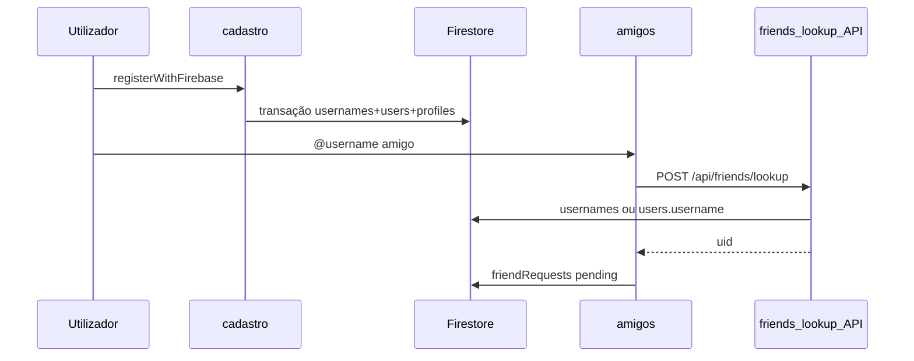

# BUG — Username ausente no cadastro / amigo não encontrado

**Data:** 2026-05-29  
**Status:** Corrigido (código) — validar com banco zerado  
**Escopo:** cadastro, login, lookup amigos, completar perfil

---

## Diagnóstico

### Cadastro e-mail (`/cadastro`)

Num registo **bem-sucedido**, `createUserProfileAfterSignup` grava na **mesma transação**:

- `usernames/{slug}` → `{ uid, createdAt }`
- `users/{uid}.username` → slug
- `publicProfiles/{uid}` + `usersPrivate/{uid}`

### Causas de “utilizador não encontrado”

| Cenário | Causa | Mitigação aplicada |
|---------|--------|-------------------|
| C1 Login Google | Conta sem username | **Google removido** da UI |
| C2 Cadastro interrompido | Auth ok, Firestore falhou | Log CRITICAL no rollback; `/completar-perfil` |
| C3 Lookup incompleto | UI só lia `usernames/{slug}` | **API** `/api/friends/lookup` + fallback Admin |

---

## Correções aplicadas

| Fix | Ficheiro(s) |
|-----|-------------|
| Remover Google | `components/auth/login-form.tsx`, `lib/auth/auth-service.ts` |
| Lookup via API | `lib/firebase/friends.ts` → `POST /api/friends/lookup` |
| Endurecer cadastro | `auth-service.ts` (CRITICAL rollback), `user-profile.ts` (throw se Firebase off) |
| Completar perfil | `app/(authenticated)/completar-perfil/page.tsx`, `profile-complete-guard.tsx`, `claimUsernameSlug` |
| Rules 1.º username | `firestore.rules` → `usernameUnchangedOrFirstSet()` |
| Backfill ops | `scripts/backfill-usernames.ts`, `npm run backfill:usernames` |

**Ops Firebase:** desactivar provider Google em Authentication → Sign-in method.  
**Rules:** publicar `firestore.rules` actualizado (primeira atribuição de username).

---

## Checklist — banco zerado (testes do zero)

Pré-requisitos:

1. E-mail/senha activo no Firebase Auth; Google **desactivado**
2. `firestore.rules` + índices publicados
3. `FIREBASE_SERVICE_ACCOUNT_JSON` configurado → `GET /api/health/admin` → `{ ok: true }`

| # | Passo | Esperado | Console Firestore |
|---|-------|----------|-------------------|
| 0 | `/login` | Sem botão Google | — |
| 1 | A regista em `/cadastro` username `user_a` | Sucesso → `/mapa` | `usernames/user_a`, `users/{A}.username` |
| 2 | B regista `user_b` | Idem | `usernames/user_b` |
| 3 | A adiciona `@user_b` em `/amigos` | Pedido enviado | `friendRequests` pending |
| 4 | B aceita | Amigo na lista | `friendships/.../list/...` bidireccional |
| 5 | F5 + logout/login | Persiste | — |
| 6 | `/mapa` | Territórios amigo (se existirem) | — |

**Backfill:** desnecessário com banco vazio. Usar `npm run backfill:usernames` só se existirem `users.username` sem doc `usernames/{slug}`.

---

## Fluxo actual (cadastro → amigo)

---

## Veredito

| Critério | Status |
|----------|--------|
| Cadastro grava username | OK (transação) |
| Google removido | OK (código) |
| Lookup amigos | OK (API + fallback local) |
| Aceitar amigo | OK (sessão anterior) |
| Homologação manual banco vazio | Pendente utilizador |

---

## Referências

- [BUG_AMIZADE_POS_ACEITE.md](BUG_AMIZADE_POS_ACEITE.md)
- [FIREBASE_PROTOTIPO_DEPLOY.md](FIREBASE_PROTOTIPO_DEPLOY.md)
