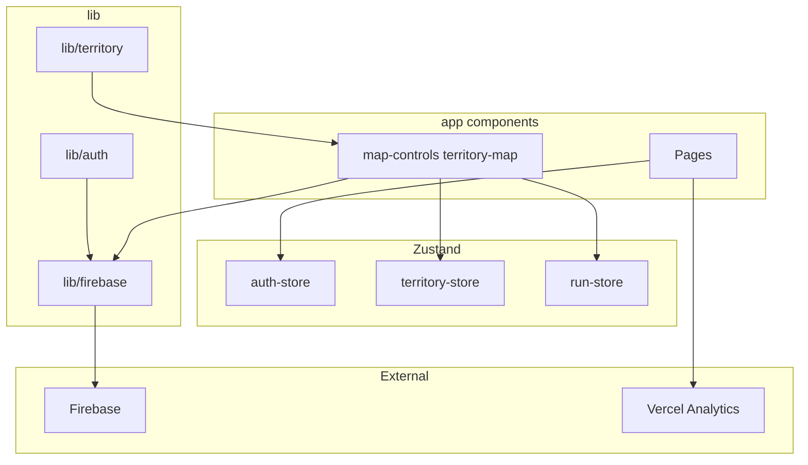

# DOC_GraphImports

## Fluxo de dados principal (textual)

## Acoplamento crítico

- **`lib/firebase/client.ts`** é importado por quase toda a camada de dados cliente — mudanças na init Firebase afetam mapa, perfil, amigos.
- **`lib/data/territory-repository.ts`** é o único ponto para leaderboard/territories subscription — mas `useLeaderboardPreview` **contorna** o repositório (acoplamento duplicado).

## Imports circulares

Não foram detetados ciclos óbvios entre `lib/firebase/config` → `client` (config não importa client). Validação estática recomendada com `madge` ou ESLint import plugin (não configurado no repo).
