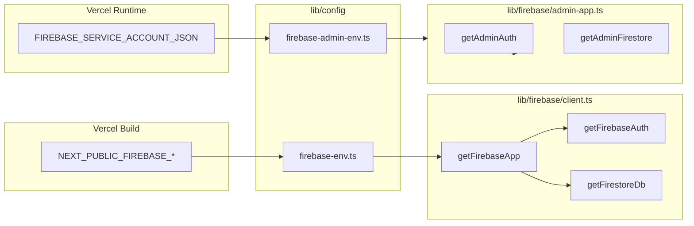

# Firebase — arquitetura de configuração

Este documento descreve a arquitetura de inicialização do Firebase no
TerritoryRun Web, depois da refatoração que removeu a dependência de
`.env.local` e centralizou a leitura de variáveis numa única camada.

## 1. Princípios

- Toda leitura de variáveis de ambiente passa por `lib/config/`.
- `process.env` é populado pelo Next.js a partir do painel da plataforma
  (Vercel em produção; `.env.local` apenas como conveniência opcional em
  desenvolvimento).
- Há uma separação rígida entre código de cliente (`'use client'`) e código de
  servidor (`import 'server-only'`).
- A inicialização do SDK é singleton para evitar múltiplas instâncias por
  request em ambiente serverless.

## 2. Estrutura de ficheiros

```text
lib/
  config/
    firebase-env.ts          # Variáveis NEXT_PUBLIC_* (cliente + servidor)
    firebase-admin-env.ts    # Service Account JSON (server-only)
  firebase/
    config.ts                # Re-exporta API estável de lib/config/firebase-env.ts
    client.ts                # Singleton FirebaseApp/Auth/Firestore (cliente)
    admin-app.ts             # Singleton firebase-admin (server-only)
    territories.ts           # Acesso à coleção territories
    ranking.ts               # Leaderboard global
    friends.ts               # FriendRequests
    user-profile.ts          # users + usernames + usersPrivate
    run-completion.ts        # runs (corridas finalizadas)
    notification-preferences.ts
    transactions.ts          # Transações Admin (captura de território)
    territory-doc.ts         # Conversão Firestore <-> domínio
```

## 3. Fluxo de inicialização



## 4. Camada `lib/config`

### 4.1 `firebase-env.ts` (público)

- Lê `NEXT_PUBLIC_FIREBASE_*` via `process.env`.
- Valida o esquema com **Zod**: campos obrigatórios são `apiKey`,
  `authDomain`, `projectId`, `appId`; restantes são opcionais.
- Expõe três funções:
  - `isFirebaseConfigured()` — booleano para alternar UI/fluxos.
  - `getFirebasePublicConfig()` — devolve o objeto sem disparar erro
    (compat. com chamadores antigos que toleram strings vazias).
  - `assertFirebasePublicConfig()` — devolve o objeto validado ou lança um
    erro descritivo apontando os campos em falta.

### 4.2 `firebase-admin-env.ts` (servidor)

- Importa `'server-only'` para falhar o build caso seja referenciado a partir
  de um Client Component.
- Faz `JSON.parse` do conteúdo de `FIREBASE_SERVICE_ACCOUNT_JSON` e valida
  com Zod (`project_id`, `client_email`, `private_key`).
- Normaliza `private_key` substituindo `\n` literais por quebras de linha
  reais (necessário quando a variável é colada via UI).

## 5. Singletons

### 5.1 Cliente — `lib/firebase/client.ts`

- Marcado com `'use client'`.
- Usa `getApps()` para reaproveitar instância já inicializada (Hot Reload).
- `getFirebaseAuth()` e `getFirestoreDb()` cacheiam o resultado em variáveis
  de módulo (instâncias por bundle).

### 5.2 Admin — `lib/firebase/admin-app.ts`

- Marcado com `'server-only'`.
- Cache em variável de módulo: dado que o ambiente serverless reutiliza
  instâncias quentes, isto evita re-`initializeApp` por invocação.
- Credencial vem de `getFirebaseAdminCredential()` (validada).

## 6. Mudanças face à arquitetura antiga

| Antes | Depois |
|-------|--------|
| `lib/firebase/config.ts` lia `process.env.NEXT_PUBLIC_FIREBASE_*` diretamente sem validação | `lib/config/firebase-env.ts` valida com Zod e expõe `assertFirebasePublicConfig` |
| `lib/firebase/admin-app.ts` parseava JSON inline com try/catch genérico | Parsing isolado em `lib/config/firebase-admin-env.ts` (server-only + Zod) |
| Mensagens de erro mencionavam `.env.local` | Mensagens neutras: "variáveis de ambiente (painel Vercel)" |
| Sem `.env.example` apesar de ser referenciado no README | `.env.example` real, com placeholders e comentários |

## 7. O que NÃO mudou

- API pública usada pelo resto do projeto: `isFirebaseConfigured`,
  `getFirebasePublicConfig`, `getFirebaseAuth`, `getFirestoreDb`,
  `getAdminAuth`, `getAdminFirestore` continuam exatamente como antes.
- Caminho dos imports `@/lib/firebase/*` permanece intacto — não houve
  alterações em call sites.
- Cloud Functions em [`functions/`](../../functions/) é deploy independente
  do Firebase CLI e não é afetado por esta refatoração.

## 8. Riscos corrigidos

- **Bundling acidental do JSON da Service Account**: `firebase-admin-env.ts`
  importa `'server-only'`, garantindo erro de build caso alguém o referencie
  a partir do cliente.
- **Erros silenciosos por env em falta**: `assertFirebasePublicConfig` agora
  identifica os campos ausentes em vez de retornar strings vazias que
  produziam falhas obscuras no SDK.
- **JSON da Service Account malformado**: detetado no parse com mensagem
  específica, em vez de falhar na chamada `cert()` mais à frente.
