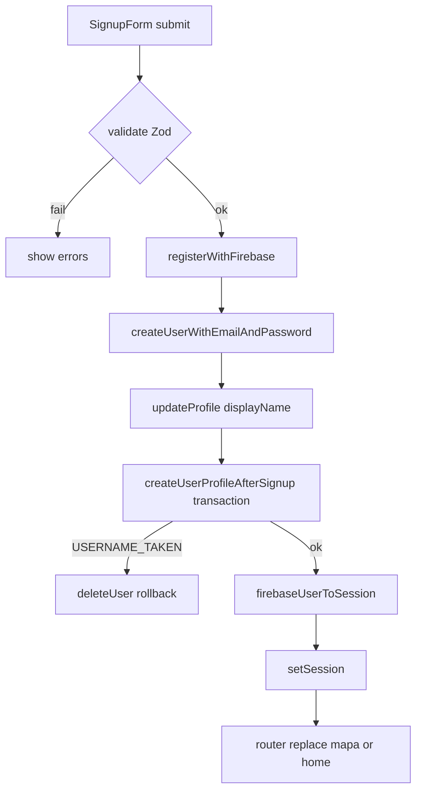

# DOC_FluxoCadastro

```mermaid
flowchart TD
  SF[SignupForm submit] --> RV{validate Zod}
  RV -->|fail| Err[show errors]
  RV -->|ok| RW[registerWithFirebase]
  RW --> CA[createUserWithEmailAndPassword]
  CA --> UP[updateProfile displayName]
  UP --> TX[createUserProfileAfterSignup transaction]
  TX -->|USERNAME_TAKEN| RB[deleteUser rollback]
  TX -->|ok| SESS[firebaseUserToSession]
  SESS --> Store[setSession]
  Store --> Nav[router replace mapa or home]
```
