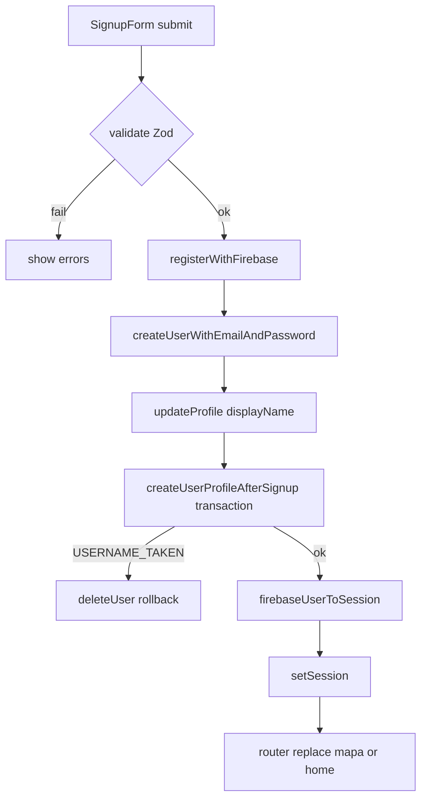

# DOC_FluxoCadastro

## Observabilidade e erros (cliente)

- Códigos mapeados em [`registerWithFirebase`](../../lib/auth/auth-service.ts): `operation-not-allowed`, `network-request-failed`, `permission-denied`, transiente Firestore (`failed-precondition`, `aborted`, `unavailable`, `resource-exhausted`). Ver [DOC_auth-service.ts.md](../Services/DOC_auth-service.ts.md).
- **`usernames/{slug}.createdAt`**: escrito como `Date.now()` (inteiro cliente) para alinhar com `firestore.rules` (`timestamp` \| `int`).
