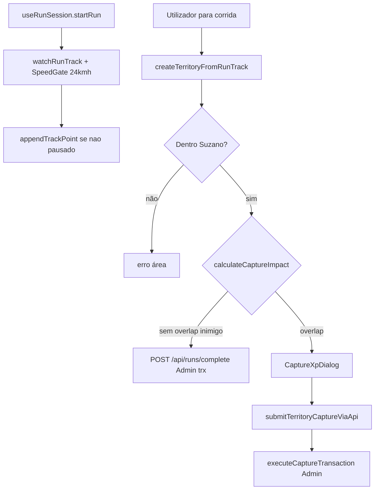

# DOC_FluxoCorridaECaptura

Dois caminhos de persistência: **corrida normal** (`submitCompletedRunViaApi` → `POST /api/runs/complete`) vs **captura hostil** (`submitTerritoryCaptureViaApi` → `POST /api/territories/capture`) — ambos Admin SDK; o cliente não escreve `territories`/`runs`/stats.

**Duração enviada à API**: tempo de parede menos [`accumulatedSpeedPauseMs`](../../lib/store/run-store.ts) enquanto `isPausedDueToSpeed`.

