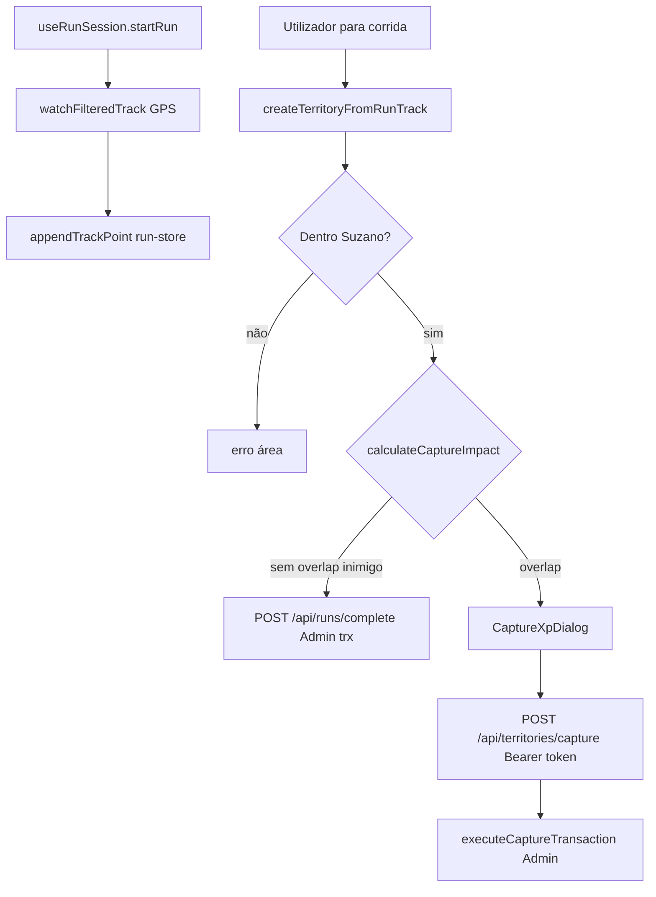

# DOC_FluxoCorridaECaptura

Dois caminhos de persistência: **corrida normal** (`POST /api/runs/complete`) vs **captura hostil** (`POST /api/territories/capture`) — ambos Admin SDK; o cliente não escreve `territories`/`runs`/stats.
