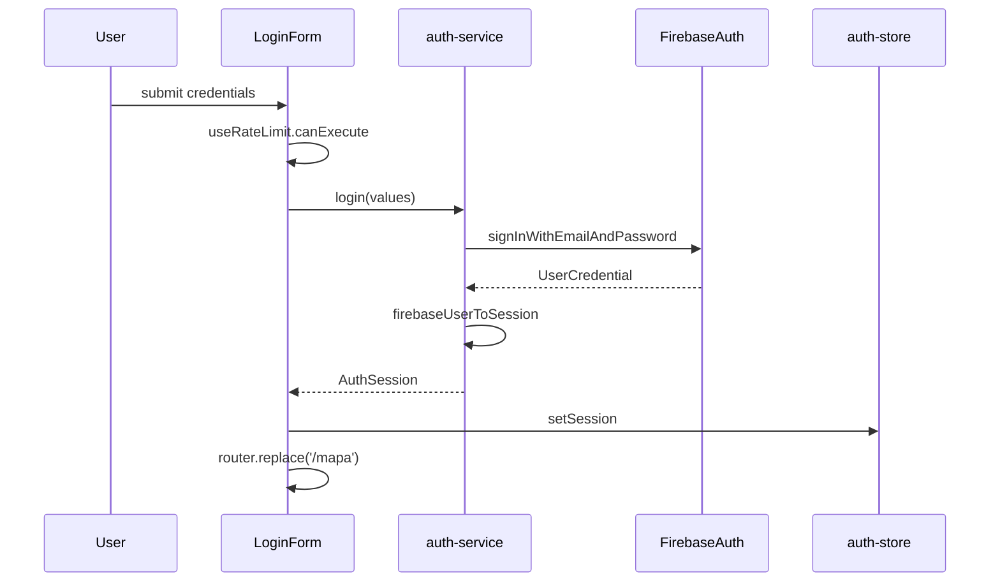

# DOC_FluxoLogin

```mermaid
sequenceDiagram
  participant U as User
  participant LF as LoginForm
  participant AS as auth-service
  participant FA as FirebaseAuth
  participant Z as auth-store

  U->>LF: submit credentials
  LF->>LF: useRateLimit.canExecute
  LF->>AS: login(values)
  AS->>FA: signInWithEmailAndPassword
  FA-->>AS: UserCredential
  AS->>AS: firebaseUserToSession
  AS-->>LF: AuthSession
  LF->>Z: setSession
  LF->>LF: router.replace('/mapa')
```

Pré-condição: `NEXT_PUBLIC_FIREBASE_*` válidas. Sem isso o botão está desabilitado.
